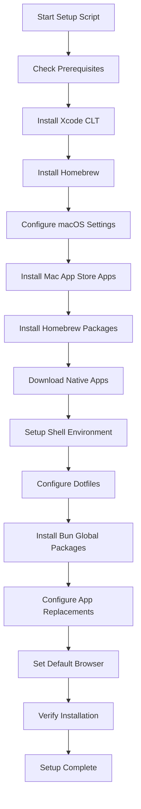

# Mac Setup Automation Script Plan

## Overview
Automation script for setting up a fresh macOS Sequoia 15.1 installation with your specific developer tools, productivity apps, and system configurations.

## Script Workflow



## Detailed Implementation Plan

### 1. Prerequisites & Setup
- Verify macOS version 15.1
- Check admin privileges
- Verify internet connectivity
- Create log file for tracking installation progress
- Implement idempotency checks throughout

### 2. Xcode Command Line Tools
```bash
# Check if already installed, if not install
xcode-select --install
```

### 3. macOS System Settings
Configure the following system preferences:
- Enable iCloud Drive for Desktop & Documents folders
- Disable widgets on desktop
- Show hidden files in Finder
- Show file extensions in Finder
- Configure Dock to auto-hide and show on hover

### 4. Homebrew Installation
- Install Homebrew if not present
- Update Homebrew to latest version

### 5. Mac App Store Apps
Install via `mas` CLI:
- Infuse 7 (id: 1136220934)
- Magnet (id: 441258766)
- Unsplash Wallpapers (id: 1284863847)

### 6. Homebrew Packages

#### Development Languages & Runtimes
- `nodejs` - JavaScript runtime
- `bun` - Fast JavaScript runtime & package manager
- `php@8.4` - PHP 8.4
- `go` - Go programming language
- `rust` - Rust programming language

#### Terminal & Shell
- `warp` - Modern terminal
- `oh-my-zsh` - Zsh framework
- `eza` - Modern ls replacement
- `fzf` - Fuzzy finder

#### Version Control & Development Tools
- `git` - Version control
- `gh` - GitHub CLI
- `gitkraken` - Git GUI client
- `chezmoi` - Dotfiles manager

#### Code Editors & AI Tools
- `visual-studio-code-insiders` - VS Code Insiders
- `claude` - Claude desktop app
- `coderabbit` - AI code review

#### API Testing
- `postman` - API development and testing platform

#### Productivity & Security
- `raycast` - Spotlight replacement
- `1password` - Password manager
- `tailscale` - VPN mesh network
- `proton-mail` - Encrypted email
- `proton-vpn` - VPN service

#### CLI Utilities
- `jq` - JSON processor
- `yq` - YAML processor
- `bat` - Better cat with syntax highlighting
- `fd` - Better find
- `ripgrep` - Better grep
- `curl` - Data transfer tool
- `wget` - Network downloader
- `shellcheck` - Shell script linter
- `shfmt` - Shell script formatter
- `uv` - Python package manager

#### Applications
- `docker` - Container platform
- `iina` - Media player
- `discord` - Communication app
- `the-unarchiver` - Archive utility
- `filen` - Cloud storage
- `shotrr` - Screenshot tool

#### Fonts
- `font-fira-code` - Programming font
- `font-jetbrains-mono` - Programming font

### 7. Native Applications
Download and install:
- Perplexity Comet Browser
- Google Chrome Stable

### 8. Shell Configuration

#### Oh-My-Zsh with Powerlevel10k Theme
```bash
# Install Oh-My-Zsh
sh -c "$(curl -fsSL https://raw.github.com/ohmyzsh/ohmyzsh/master/tools/install.sh)"

# Install Powerlevel10k theme
git clone --depth=1 https://github.com/romkatv/powerlevel10k.git ${ZSH_CUSTOM:-$HOME/.oh-my-zsh/custom}/themes/powerlevel10k
```

### 9. Dotfiles Configuration

#### .zshrc Configuration
```bash
# Theme
ZSH_THEME="powerlevel10k/powerlevel10k"

# Plugins
plugins=(git docker kubectl aws node bun)

# Aliases for eza
alias ls='eza --icons'
alias ll='eza -l --icons'
alias la='eza -la --icons'
alias lt='eza --tree --icons'

# Bun aliases to replace npm/npx
alias npm='bun'
alias npx='bunx'

# Additional aliases
alias cat='bat'
alias find='fd'
alias grep='rg'

# Path additions for development tools
export PATH="$HOME/.bun/bin:$PATH"
export PATH="/opt/homebrew/bin:$PATH"
```

#### .gitconfig Configuration
```gitconfig
[user]
    name = Your Name
    email = your.email@example.com
[core]
    editor = code-insiders --wait
[init]
    defaultBranch = main
[pull]
    rebase = false
```

### 10. Bun Global Packages
Install the following packages globally with Bun:
- `@cloudflare/claude-code` - Claude code CLI
- `@openai/codex` - OpenAI Codex CLI
- `@google/gemini-cli` - Google Gemini CLI
- `ccusage` - Code complexity tool
- `@githubnext/copilot-cli` - GitHub Copilot CLI
- `@kilocode/cli@alpha` - Kilocode CLI alpha version

### 11. App Replacements

#### Raycast replaces Spotlight
- Disable Spotlight keyboard shortcut
- Configure Raycast to use Cmd+Space

#### Warp replaces Terminal
- Set Warp as default terminal application
- Configure Warp settings and themes

### 12. Set Default Browser
- Set Perplexity Comet as the system default browser

## Script Structure

### Main Script Components
```
setup-mac.sh
├── functions/
│   ├── prerequisites.sh
│   ├── macos-settings.sh
│   ├── homebrew.sh
│   ├── apps.sh
│   ├── shell-config.sh
│   └── defaults.sh
├── config/
│   ├── packages.txt
│   ├── mas-apps.txt
│   └── settings.conf
└── logs/
    └── setup-YYYY-MM-DD.log
```

### Key Features
- **Modular Design**: Each component in separate function file
- **Idempotency**: Check before installing to avoid duplicates
- **Error Handling**: Comprehensive error checking with clear messages
- **Logging**: Detailed logs of all operations
- **Progress Tracking**: Visual feedback during installation

## Usage Instructions

```bash
# Make script executable
chmod +x setup-mac.sh

# Run the setup script
./setup-mac.sh

# Run specific components only
./setup-mac.sh --only homebrew,settings

# Dry run to see what would be installed
./setup-mac.sh --dry-run
```

## Post-Installation Manual Steps

1. **Sign in to applications:**
   - 1Password
   - Tailscale
   - Proton Mail & VPN
   - Discord
   - Filen
   - Postman

2. **Configure Raycast:**
   - Import settings
   - Set up extensions
   - Configure hotkeys

3. **VS Code Insiders Setup:**
   - Sign in with GitHub for settings sync
   - Install preferred extensions

4. **Generate SSH Keys:**
   ```bash
   ssh-keygen -t ed25519 -C "your.email@example.com"
   ```

5. **Configure Git credentials:**
   ```bash
   git config --global user.name "Your Name"
   git config --global user.email "your.email@example.com"
   ```

## Notes

- The script is designed to be run on a fresh macOS 15.1 installation
- All installations are checked for existing presence to avoid duplicates
- Logs are saved for troubleshooting
- Some manual steps are required for app authentication and personal preferences