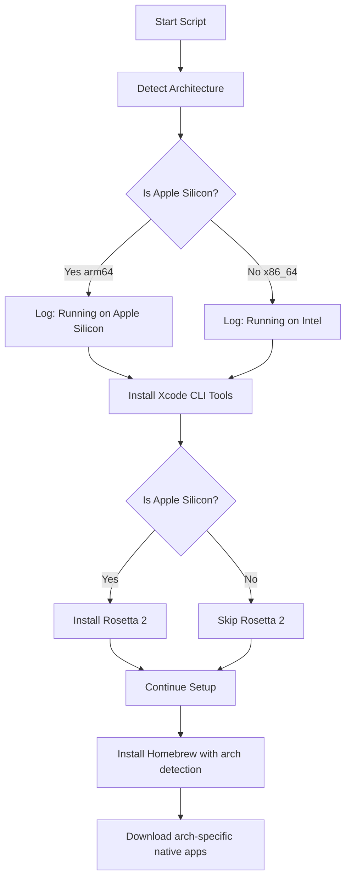

# Rosetta 2 Installation & Apple Silicon Support Plan

## Overview
This plan outlines the integration of Rosetta 2 installation and comprehensive Apple Silicon support into the Mac setup script. The implementation focuses on Apple Silicon as the primary platform while maintaining basic Intel compatibility.

## Architecture Detection Flow



## Implementation Details

### 1. Architecture Detection Utility

**Location:** `setup-mac.sh` (Utility Functions section)

**Function:** `get_architecture()`
- Returns: `arm64` or `x86_64`
- Uses: `uname -m` command
- Purpose: Central architecture detection for all components

**Function:** `is_apple_silicon()`
- Returns: 0 (true) if Apple Silicon, 1 (false) if Intel
- Purpose: Simplified conditional checks throughout script

### 2. Rosetta 2 Installation

**Location:** `functions/xcode.sh`

**Function:** `install_rosetta2()`
- Check if Rosetta 2 is already installed
- Command: `softwareupdate --install-rosetta --agree-to-license`
- Silent installation (non-interactive)
- Error handling for installation failures
- Success/skip logging

**Integration Point:**
- Called from `install_xcode_tools()` after Xcode CLI installation
- Only executes on Apple Silicon Macs
- Runs before Homebrew installation (ensures x86_64 compatibility)

### 3. Architecture-Specific Native Apps

**Location:** `functions/packages.sh`

**Apps to Update:**
1. **Synergy** (currently hardcoded to arm64)
   - Detect architecture
   - Use arm64 URL for Apple Silicon
   - Use x86_64 URL for Intel
   
2. **Perplexity Comet** (currently uses `darwin_universal`)
   - Keep universal binary approach (works on both)
   
3. **boringNotch**
   - Check if separate binaries exist
   - Use universal binary if available

### 4. Logging & User Communication

**Startup Logging:**
- Display detected architecture
- Show Rosetta 2 status on Apple Silicon
- Warn Intel users that script is optimized for Apple Silicon

**Example Output:**
```
[2025-10-16 01:30:00] System Architecture: Apple Silicon (arm64)
[2025-10-16 01:30:01] ✅ Running on supported macOS version: 15.1
[2025-10-16 01:30:05] Installing Rosetta 2 for x86_64 compatibility...
[2025-10-16 01:30:15] ✅ Rosetta 2 installed successfully
```

### 5. Documentation Updates

**README.md Sections to Add:**

1. **System Requirements:**
   - Primary support: Apple Silicon (M1, M2, M3, M4)
   - Limited support: Intel Macs
   - Rosetta 2 automatically installed on Apple Silicon

2. **Architecture Support:**
   - Explain Rosetta 2 purpose
   - List benefits for Apple Silicon users
   - Note about x86_64 compatibility

3. **Troubleshooting:**
   - Rosetta 2 installation issues
   - Architecture-specific app failures
   - Intel Mac limitations

## Technical Specifications

### Rosetta 2 Detection
```bash
# Check if Rosetta 2 is installed
if /usr/bin/pgrep -q oahd; then
    # Rosetta 2 is running
fi

# Alternative check
if arch -x86_64 /usr/bin/true 2>/dev/null; then
    # Rosetta 2 is installed
fi
```

### Rosetta 2 Installation Command
```bash
softwareupdate --install-rosetta --agree-to-license
```

### Architecture Detection
```bash
# Get current architecture
ARCH=$(uname -m)

# Check for Apple Silicon
if [[ "$ARCH" == "arm64" ]]; then
    # Apple Silicon
else
    # Intel (x86_64)
fi
```

## Error Handling Strategy

### Rosetta 2 Installation Failures
1. Log detailed error message
2. Continue script execution (non-critical for many packages)
3. Warn user about potential x86_64 app compatibility issues
4. Provide manual installation instructions in logs

### Architecture-Specific App Downloads
1. Detect architecture before download
2. Select appropriate URL
3. Fallback to universal binary if available
4. Clear error messaging if architecture not supported

### Intel Mac Warnings
1. Display warning at script start
2. Inform user of optimization for Apple Silicon
3. Continue execution with reduced feature set
4. Log any skipped Apple Silicon-specific features

## Testing Strategy

### Test Cases
1. **Apple Silicon Mac:**
   - Rosetta 2 not installed → Should install
   - Rosetta 2 already installed → Should skip
   - Architecture detection → Should return arm64
   - Native apps → Should download arm64 versions

2. **Intel Mac:**
   - Should skip Rosetta 2 installation
   - Architecture detection → Should return x86_64
   - Should show optimization warning
   - Native apps → Should download x86_64 versions

3. **Dry-Run Mode:**
   - Should log Rosetta 2 installation intent
   - Should detect architecture correctly
   - Should not actually install Rosetta 2

## Implementation Order

1. ✅ Architecture detection utilities (`setup-mac.sh`)
2. ✅ Rosetta 2 installation function (`functions/xcode.sh`)
3. ✅ Integration with Xcode tools (`functions/xcode.sh`)
4. ✅ Architecture-specific app URLs (`functions/packages.sh`)
5. ✅ Startup logging (`setup-mac.sh` main function)
6. ✅ Intel Mac warnings (`setup-mac.sh` prerequisites)
7. ✅ Documentation updates (`README.md`)
8. ✅ Testing and validation

## Benefits

### For Apple Silicon Users
- Automatic Rosetta 2 installation for x86_64 compatibility
- Optimized native arm64 applications
- Faster performance with native binaries
- Seamless x86_64 fallback when needed

### For Intel Users
- Script still functional (though optimized for Apple Silicon)
- Clear messaging about platform optimization
- Proper x86_64 binary downloads
- No unnecessary Rosetta 2 installation attempts

## Compatibility Matrix

| Component | Apple Silicon | Intel | Rosetta 2 Required |
|-----------|---------------|-------|-------------------|
| Xcode CLI Tools | ✅ Native | ✅ Native | ❌ |
| Homebrew | ✅ Native | ✅ Native | ❌ |
| Rosetta 2 | ✅ Installed | ⚠️ Skipped | N/A |
| Node.js | ✅ Native | ✅ Native | ❌ |
| Docker | ✅ Native | ✅ Native | ⚠️ For x86 containers |
| Bun | ✅ Native | ✅ Native | ❌ |
| Native Apps | ✅ arm64/universal | ✅ x86_64 | ❌ |
| Legacy Apps | ⚠️ Via Rosetta 2 | ✅ Native | ✅ |

## Post-Implementation Validation

### Checklist
- [ ] Architecture correctly detected on both platforms
- [ ] Rosetta 2 installs successfully on Apple Silicon
- [ ] Rosetta 2 skipped appropriately on Intel
- [ ] Native apps download correct architecture versions
- [ ] Homebrew paths correct for both architectures
- [ ] Logging provides clear architecture information
- [ ] Documentation updated with architecture details
- [ ] Error messages clear and actionable
- [ ] Dry-run mode works correctly
- [ ] Intel Mac warning displays appropriately

## Notes

- Rosetta 2 installation is silent and non-interactive
- Installation typically takes 1-3 minutes depending on internet speed
- Rosetta 2 is required for some legacy x86_64-only applications
- Modern Homebrew (4.0+) runs natively on both architectures
- Some casks may only be available for one architecture